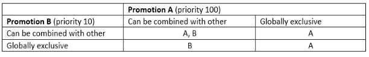
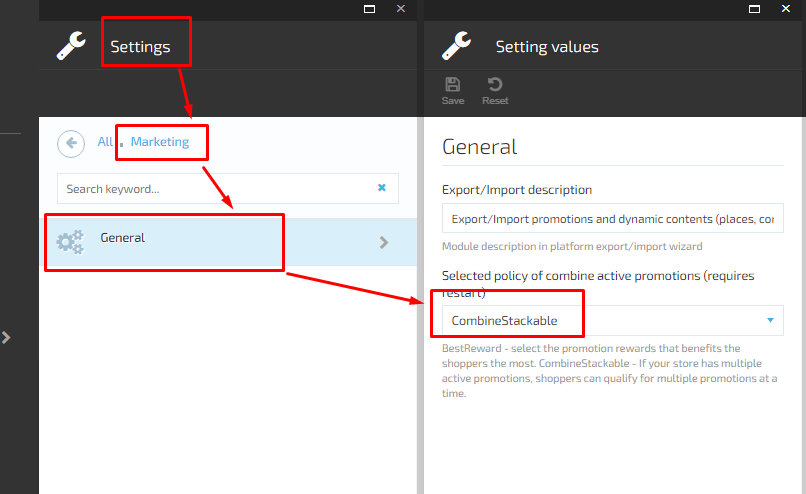
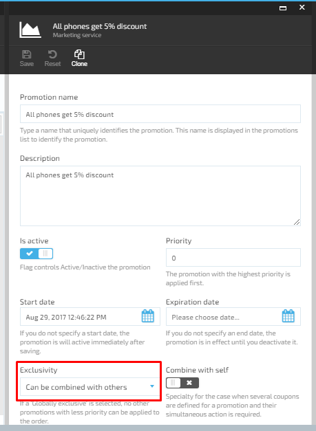

# Combine Active Promotions

VirtoCommerce Marketing Module represents two basic promotion combination policies:  

1. **Best reward policy** - select the promotion reward, that benefits a customer the most.
1. **Combine stackable policy** - If your store has multiple active promotions, shoppers can qualify for multiple promotions at a time.  

## Combine Stackable Policy

With this policy each promotion can be combined with all other promotions in an order. In addition, resulting promotion rewards can be stacked on the top of other promotions rewards in the same reward group (shipment, item, order), which overrides certain promotion policies. The priority of promotions determines whether a stackable promotion reward applies to the order. 

The following table details how promotions rewards are applied compared to other promotions. How promotions are applied is based on different priorities and the exclusivity with other promotions settings:

**Important**: Stackable combination policy has a constraint- Stackable combination policy has a constraint - if the total order or any object price is less than zero after a promotion is applied, then this reward will be skipped and next reward by priority will be taken.

### Switch on Promotion Stackable Combination Policy  

1. Open Settings -> Marketing -> General
1. Choose CombineStackable value for setting 'Selected policy of combine active promotions'. **Notice**: This setting will be applied only after application restart.

1. Open Promotion detail blade
1. The system will display new fields: 'Priority', 'Exclusive within an order', 'Combine with self'.
1. Use these fields to control the promotion combinations behavior.

## Best Reward Policy  

As a result of this combination policy, no rewards are stacked, and the user receives only the best rewards for each group (which is the most beneficial to the client).
