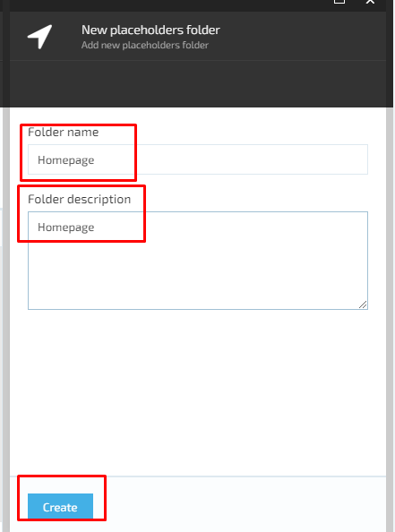
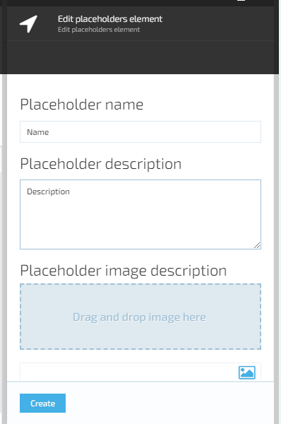

# Manage Content Placeholders

## Create Placeholder Folder

The Placeholder folder is a container for placeholders. In order to create a Placeholder folder the user should do the following:

1. Open Marketing Module
1. Navigate to Dynamic content->Content Placeholder and click 'Add'
1. The system will dipslay the 'New Placeholders elements' blade :
     1. Placeholder folder;
     1. Placeholder.
1. The user selects the 'Placeholder folder';
1. The system will open the 'New Placeholders folder' screen;
1. The user enters the Name and description and clicks the 'Create' button;
1. The new placeholder folder will be created and displayed on the list;
1. The Placeholder folder can be both edited and deleted.

## Create New Placeholder

The Placeholder is a container for content items. 

1. Open Marketing Module
1. Navigate to Dynamic content->Content Placeholder and click 'Add'
1. The system will display the 'New Placeholders elements' blade :
     1. Placeholder folder;
     1. Placeholder.
1. The user selects the 'Placeholder';
1. The system will open the 'Edit placeholder's element' screen;
1. The user enters the name, description, upload image and clicks the 'Create' button
1. The new placeholder will be created and displayed on the list;
1. The system allows editing and deleting placeholders.

