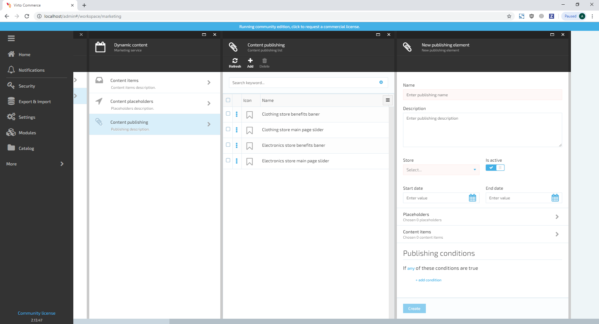
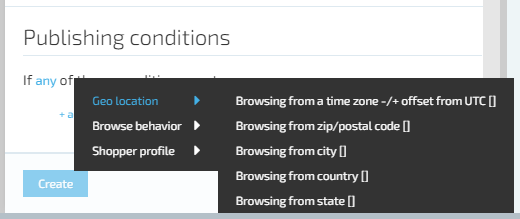
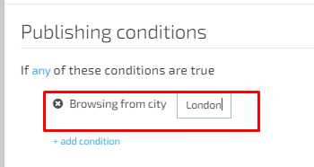

# Manage Content Publishing

## Create Content Publishing

Content publishing sets the delivery conditions of the Dynamic Content. Therefore, before creating Content Publishing the required Dynamic Content and Content Place should be registered (created) in the system.

1. In order to create Content publishing, the user should navigate to Dynamic content->Content publishing and click the ‘Add’ button;
1. The system will display the ‘New publishing element’ screen:

     1. ‘Name’ input text field- required;
     1. ‘Description’ text box- optional;
     1. ‘Store’ drop- down- required;
     1. ‘Is Active’ property sets activity of the Content Publishing;
     1. Priority property sets the priority of the Content Publishing. If more than one Dynamic Content configured to be displayed in the Content Place at some conditions, the Dynamic Content configured in the Content Publishing with higher priority will be displayed;
     1. ‘Available from’ and ‘Available to’ sets the dates range when the Content should be available. These properties are useful to set banners for promotions that are limited by dates. If the Content should be displayed always, the fields should be left blank;
     1. ‘Placeholders’ it’s where dynamic content should be displayed:

         1. Content Placeholders are predefined by the personnel that has permissions to register Content Placeholders in the system;
         1. More than one Content Placeholder can be selected if the Dynamic content should be displayed in more than one Content Placeholder.
     1. Content items;
         1. More than one Content item can be selected if more than one Content item should be displayed.
     1. Publishing conditions.
1. The user should set up the following:

     1. Enter publishing name;
     1. Enter description;
     1. Select a store from the drop- down list;
     1. Set the ‘Is Active’ property if needed;
     1. Select a placeholder for the dynamic content;
     1. Select Dynamic content items;
     1. Set up the publishing conditions:  

         1. By default, the Dynamic Content will be displayed to any customer that views the page with the selected Content Placeholder;
         1. If the Dynamic Content should be displayed under specific conditions, the user should set them up on this step using the Expression builder.
1. The user clicks the ‘Create’ button;
1. The system will display the created Content Publishing on the list.  

### Expression Builder

Expression builder is used to create a readable set of conditions, under which the Dynamic Content should be displayed.

Expression builder consists of two main parts:

* The first is the global operator for the whole conditions set. It sets if the expression returns true if any of the conditions satisfied or if all of the conditions are satisfied. The behavior is set using all/any operand.
* The second part is the conditions collection. Available conditions are grouped into four groups:

1. Browse Behavior;
1. Customer Profile;
1. Geo location;
1. Shopping cart.

The condition value can be string and decimal.

The operators for string value conditions can be:

1. Matching (means the value of the context appropriate Tag should match the entered value);
1. Contains (means the value of the context appropriate Tag should contain the entered value; The comparison is case-invariant)
1. Not matching (means the value of the context appropriate Tag should not match the entered value);
1. Not contains (means the value of the appropriate context Tag should not contain the entered value. The comparison is case-invariant).

Operators for decimal value conditions can be:

1. Greater than (means the value of the appropriate context Tag should be greater than the entered value);
1. Greater than or equals (means the value of the appropriate context Tag should be greater than or equals the entered value);
1. Less than (means the value of the appropriate context Tag should be less than the entered value);
1. Less than or equals (means the value of the appropriate context Tag should be less than or equals the entered value);
1. Matching (means the value of the appropriate context Tag should matches the entered value).

### Add New Condition

1. The user selects '+Add condition';
1. The system will display the menu with condition groups;
1. The user hovers the required group;
1. The conditions of the group will expand;
1. The user selects the required condition;
1. The selected condition will appear in the expression builder;
1. The user sets the value for the selected conditions and saves the changes

## Edit Publishing Content

1. The user shouldoOpen the Marketing module, navigate to Dynamic content->select the Publishing Content that should be edited->makes the editing and saves the changes
1. The system will save the changes made and display the edited Publishing content.

## Delete Publishing Content

1. The user opens marketing Module->navigates to Dynamic Content->selects Content publishing tab->selects the publishing content he wants to delete and clicks the 'Delete' button;
1. The system will display a notification message :' Are you sure you want to delete this publication?'- 'Yes', 'No', 'Cancel';
1. The user confirms deletion by clicking the 'Yes' button;
1. The system will delete the publishing content.

