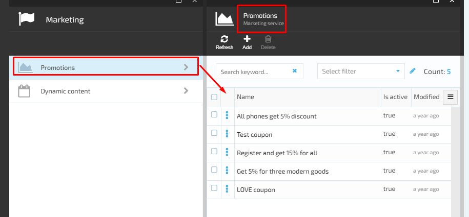
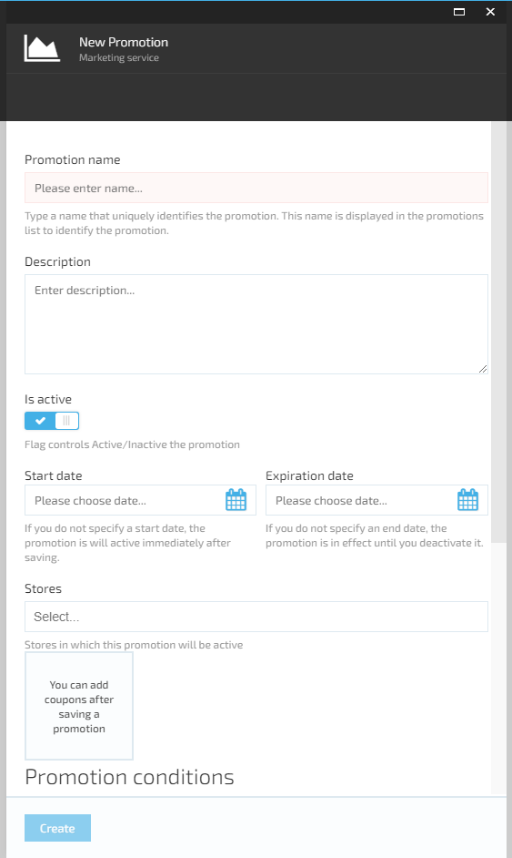
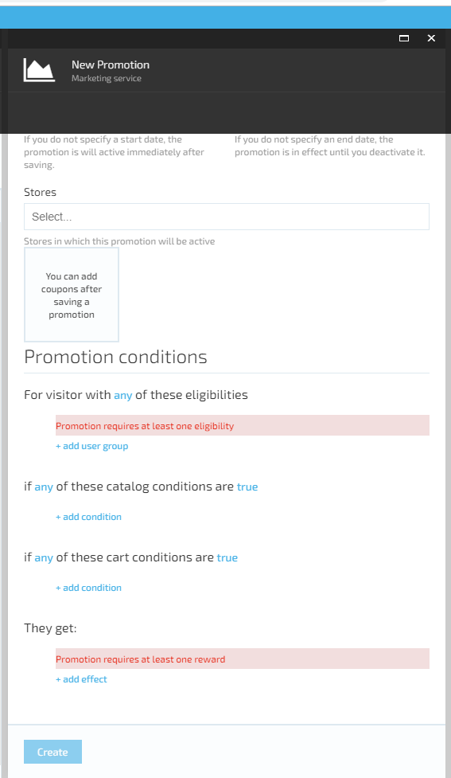

# Manage Promotions

## View Promotions

1. The user browses the Marketing Module and navigates to Promotions tab;
1. The system will display the list of existing Promotions on 'Promotions' blade.

## Create New Promotion

1. The user opens Marketing Module->navigates to Promotions tab and click the 'Add' button
1. The system will display the 'New Promotion' screen
1. The user sets up the promotion properties (see the table bellow for more explanation) and clicks the 'Create' button
1. The new promotion will be created by the system and displayed on the 'Promotions' list. 

| Field Name | Description |
|------------|-------------|
|Promotion Name | Sets the name of the promotion. Set it as meaningful as possible for the later search purposes |
| Description | Sets the meaningful description of the promotion |
| Store | The store to which the new promotion applies |
| Start Date | Sets the start date of the promotion. Available from the creation if not set |
| Expiration Date | Sets the end date of the promotion. Available until disabled if not set |
| Usage Limit | Sets the maximum amount of times the promotion can be applied. If set 0 the promotion will be limitless |
| Per Customer Limit | Sets the amount of times the promotion can be applied to the same customer. If set 0 the promotion will be limitless |
| Promotion Conditions | Setup promotion rules (conditions) under which the promotion will be applied |

## Edit Promotion

1. The user opens Marketing Module and navigates to 'Promotions' -> selects the promotion-> makes the editing and saves the changes;
1. The system will save the changes and display the edited promotion on the list.

**Important**: The 'Store' property for the Cart promotion and the 'Catalog' property for the Catalog promotions are not editable!

## Delete Promotion

1. The user opens Marketing Module and navigates to 'Promotions' -> selects the promotion and clicks 'Delete';
1. The system will display a notification message: 'Are you sure you want to delete the selected promotion?- 'Yes'/'No'/'Cancel';
1. The user selects 'Yes';
1. The system will delete the selected promotion and remove it from the list of Promotions.

