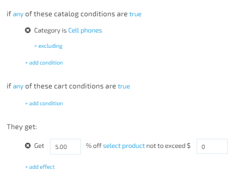
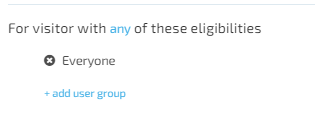
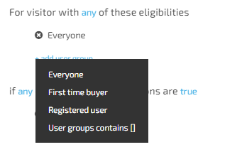

# Promotion Rules

**Promotion rules** define the behavior and effects of promotions. There are two types of promotion rules:

* Conditions
* Effects

## Promotion Conditions

Promotion Conditions are split into two groups:

* Catalog Promotion Conditions
* Cart Promotion Conditions

### Catalog Promotion Conditions

Catalog promotion conditions are used to make specific products and categories of products more attractive to shoppers through incentives, such as lowered pricing on a particular brand.

A catalog promotion condition grants all shoppers a discount on a specific product or set of products.

 Promotion with matching catalog conditions are always visible to shoppers, so the price they see while browsing the site is the price they pay at checkout time (except taxes and any promotions with matching shopping cart conditions that may apply).

### Cart Promotion Conditions

Cart promotion conditions are used to encourage shoppers to increase their order size by providing incentives, such as free shipping on orders over a certain sum. A shopping cart promotion conditions grants a discount on a specific product or set of products to shoppers who meet them. Cart promotions are only applied after the promotion conditions expression returned true. Thus, a shopper only sees the price that will be paid for a promoted item when it's viewed in the shopping cart or during checkout (assuming all the promotion's conditions are met).

For example, a product has a list price of $100.00. Currently, there is a shopping cart promotion that grants a 5% discount to all orders over $99.00. When browsing the catalog, all shoppers see the product's $100.00 list price. If a shopper adds the product to the shopping cart and then views the cart's contents, the price of the cart is $95.00 (due to the 5% discount). If the same shopper goes back to browsing the frontend, the catalog still shows the list price of $100.

Conditions are the set of criteria that determine, based on the current state of the cart, whether a shopper is eligible for a promotion.

## Effects

The **Effects**  specify what benefits are granted by a promotion. They are the incentives used to encourage customers to purchase more or to purchase specific items. Examples of effects are:

* free shipping;
* discounts on specific products;
* free items;
* coupons for discounts on future purchases.

## Expression builder's visitor block

The visitor block is similar to promotion rules. It specifies criteria that determine if the visitor is eligible to receive a promotion based on the information that was received about the visitor.  

There are four options:

* Everyone - no filtering
* Registered user - *user that is currently logged in to storefront
* First time buyer - registered user who has never made any purchase
* User groups contains[]

Screen-visitor-options

**Important**: The user who has just created an account , is a first-time buyer!

## Activation rules

Activation rules determine how promotions are applied to the eligible purchases. In the simplest case, a promotion is applied automatically. This means that, if the customer meets all conditions, he receives the promotion action automatically, whether it's a discount on an item, free shipping, a coupon, etc.

Some promotions need to be "activated" by a coupon code (also referred to as a promotion code). For example, to receive a discount on an item in the shopping cart, the customer must enter a coupon code at checkout time. If your organization uses coupon codes, you will need to configure certain rules to control how they can be used with each promotion.

When you create a promotion, you need to specify whether it's activated automatically or by a coupon.

### Coupons

Coupons can be used by any eligible customer. This means that any customer who qualifies for a promotion can use coupon code associated with that promotion. Customers may re-use a previously redeemed coupon code.

