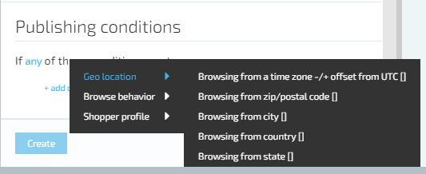

# Publishing Conditions 

Virto Commerce is shipped with the most commonly used tags. The following tag groups are included with Virto Commerce:

Browse Behavior
Customer Profile
Geo location

By default, condition statements within a statement block are inclusive. They are considered to be joined by ‘all’ clause unless explicitly joined by  ‘any’ operator.

## Condition Operators

Tag operators for Dynamic Content conditions are either string or integer.

* Matching implies that the characters in the value for the tag must match those returned by the tag in order for the condition to be true. (the match is NOT case-sensitive.)
* Contains operator is true if the value set for the condition is found anywhere within the returned string.
* Matching (case sensitive) and contains (case sensitive) perform their expected match or includes operations but will only evaluate to true if the founded values match the upper and lower case characters of those searched.
